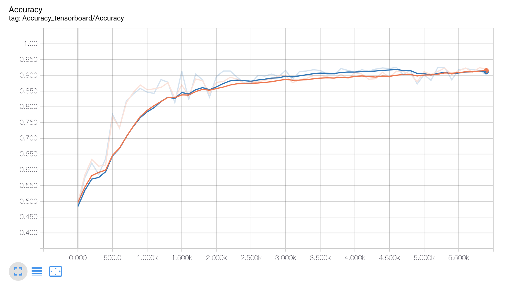

# Machine Subvocalization Command Recognition
This repository includes the Machine Learning model used to classify subvocalized commands. The easiest way to understand subvocalization was by this explanation: When we were young and we learned to read we would say the words out loud, but later when we started getting better reading we could read without the necessity of saying out loud but still hearing that voice in our head. So, subvocalization as we were just about to say something, but not saying, this causes the muscles near our vocal cords to actually move, but not enough for it to be noticeable. 

### Data
The data for this experiment was captured using electrodes to get the muscle signals. Once the signal was captured, I converted it into a spectrogram to be able to analyze it with 2-D Convolutions. The script for this information is inside the data folder. 

### Approach
My approach to solving this challenge was to use a Convolutional Neural Network working with the spectrograms of the audios. Since what we wanted to do was to classify the signals as one or two, the model ends in a simple fully connected layer with 2 nodes.

### Architecture
The architecture I chose for this model was based on the paper written by William Song and Jim Cai titled: [End-to-End Deep Neural Network for Automatic
Speech Recognition](https://cs224d.stanford.edu/reports/SongWilliam.pdf). 
The final objective of this experiment is to create a mobile device capable to run the model on the edge which limits the computational power available. Recurrent neural networks are really computationally expensive, for this reason I removed them from my model and used two fully connected layers instead. 
#### Graph
- Concatenate the different channels to get a [160, 150, 12] input
- Convolutional layer No. 1 | Kernel = [5, 3, 12, 128] | Stride = [1,1,1,1] | Activation function = ReLU
- Max pool layer No. 1 | Kernel = [1, 2, 2,1] | Stride = [1, 2, 2,1]
- Dropout layer No. 1

- Convolutional layer No. 2 | Kernel = [5, 3, 128, 256] | Stride = [1,1,1,1] | Activation function = ReLU
- Max pool layer No. 2 | Kernel = [1, 2, 2,1] | Stride = [1, 2, 2,1]
- Dropout layer No. 2

- Convolutional layer No. 3 | Kernel = [3,  3,  256, 384] | Stride = [1,1,1,1] | Activation function = ReLU
-  Convolutional layer No. 4 | Kernel = [3,  3, 384, 384] | Stride = [1,1,1,1] | Activation function = ReLU
- Max pool layer No. 3 | Kernel = [1, 2, 2,1] | Stride = [1, 2, 2,1]
- Dropout layer No. 3

- Flatten output from the dropout layer
- Fully Connected layer | Nodes = 1024 | Activation function = ReLU
- Fully Connected layer | Nodes = 128 | Activation function = ReLU
- Fully Connected layer | Nodes = 2 | (output layer)

#### Tensorboard representation of graph

### Training
In order to train the model, I used softmax cross-entropy as a loss function, taking the mean of it to optimize the model. The optimizer I chose is Adam optimizer with a learning rate of 0.001 and a batch size of 32 images. In order to train the model, I used 1 GPU instance in GCP, training for 6000 steps. 

#### Accuracy graph

#### Loss graph

### Results
After training the model for 6000 steps I got **84.8% of accuracy** on my test set, using my 5000 step model because after the 5000 step the model started to overfit the training data as it can be seen in the accuracy graph when the validation diverges from the training. 

### References
- https://www.tensorflow.org/guide/
- https://cs224d.stanford.edu/reports/SongWilliam.pdf
- http://sox.sourceforge.net/sox.html
- https://www.media.mit.edu/projects/alterego/overview/

### Authors
Juan Pedro Casian - Github: [@JuanCasian](https://github.com/JuanCasian) - Email: juanpedrocasian@gmail.com
